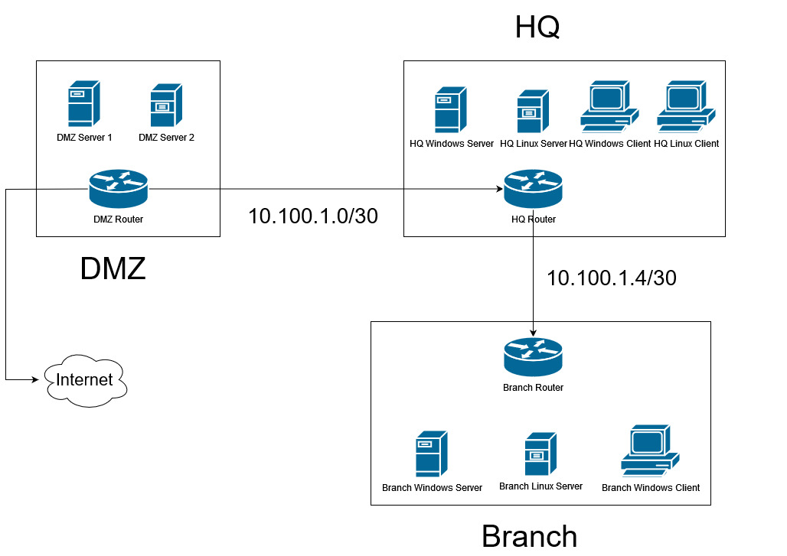

Веселые старты.jpg

# Роутинг
На каждом роутере должен быть настроен hostname и SSH, домен company.lan
DNS сервер по умолчанию - HQ Windows Server

Все роутеры должны дружить между собой по OSPF в 0 зоне, если не получается - можно статику. (https://rbgeek.wordpress.com/2012/06/08/ospf-routing-between-ciscoubuntucentos-and-mikrotik-router/)

Между HQ и Branch соединение должно быть защищено при помощи IPSec
Между роутерами используйте любой для них доступный адрес из диаграммы 

Чтобы определить какой интерфейс относится к какой подсети, посмотрите настройки виртуальной машины(лол)

# DMZ

На DMZ Server 1 и 2 развернуть Wordpress через Docker и Docker-Compose.
(https://hub.docker.com/_/wordpress)

Базу данных MySQL/MariaDB для Wordpress разверните на одном из этих двух серверов классическим способом.

Имплементируйте на DMZ Server 1 реверс прокси Nginx, доменное имя сайта allstars.company.lan, проксируйте запросы на Wordpress DMZ Server 1 и 2

Сделайте сайт доступным другие сети, при помощи проброса портов на DMZ Router.

Поднимите OSPF между другими роутерами и анонсируйте маршрут по умолчанию (3 порт роутера DMZ Server это выход в интернет)

# HQ
Разверните контроллер домена на HQ Windows Server, домен - company.lan

На HQ Windows Server разверните DHCP сервер для данной подсети
Создайте следующую структуру домена, для пользователей используйте пароль "P@ssw0rd"
OU | Username and First Name
--- |  --- | 
Sales | Mark
Sales | Bob
Secure | Alice
Admins | Yegor
IT | Vlad

Для каждой OU настройте свою уникальную обоину на рабочем столе

На HQ Linux Server разверните центр сертификации, все сервера должны ему доверять

На HQ Linux Server разверните NFS сервер и храните в нем docker-compose.yaml для DMZ Server 1 и 2, для каждого сервера в отдельной папке

Подключите HQ Windows Client в домен и настройте как страницу по-умолчанию в IE сайт allstars.company.lan

На HQ Linux CLI установите любой графический интерфейс и так же сделайте по-умолчанию в браузере Firefox сайт allstars.company.lan

# Branch 
Сделайте Branch Windows Server контроллером домена только для чтения для домена company.lan

Добавьте клиента и linux сервер в домен

На Branch Linux Server разверните Grafana, через Syslog получите логи DMZ Server 1 и 2

Разверните DHCP сервер на Branch Router для данной подсети

### Таблица адресов хостов
Host | Address
--- |  --- |
DMZ Server 1 | 10.1.1.10/24
DMZ Server 1 | 10.1.1.20/24
DMZ Router 1 | 10.1.1.1/24
HQ Windows Server | 10.2.1.10/24
HQ Linux Server| DHCP
HQ Windows Client | DHCP
HQ Linux CLI | DHCP
HQ Router | 10.2.1.1/24
Branch Windows Server | 10.3.1.10/24
Branch Linux Server| 10.3.1.20/24
Branch Windows Client | DHCP

